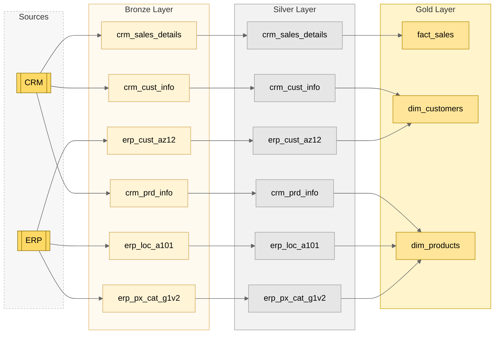

# 📦 Project: Building a Modern SQL Data Warehouse

This project is a hands‑on implementation of a **modern SQL data warehouse built from scratch**, following industry best practices.  
The goal? To develop a solid understanding of the key skills needed to implement real‑world data‑warehousing projects—useful for both **data analysts** and **data engineers**.

---

## 📋 Project Description

The project focuses on **preparing data for analysis**, structured around three main stages:

### 🧱 Data Architecture  
Designing a clear, scalable, and efficient architecture based on **modern best practices**.

### 🛠️ Data Engineering  
Writing SQL code to **clean**, **transform**, **load**, and **prepare data** for analytics.

### 📊 Data Modeling  
Creating a **new data model from scratch**, optimized for performance, clarity, and analytical use.

---

## 🧰 Technologies Used

- **SQL Server 2022** (primary DB engine)  
- **Azure Data Studio** (IDE for SQL development)  
- Concepts easily adaptable to **PostgreSQL**, **MySQL**, and other RDBMS platforms  

---

## 🔄 ETL Process (Extract, Transform, Load)

A core component of this project is implementing a robust **ETL process**, with a focus on **efficiency** and **scalability**.  
Both **full extraction** and **incremental extraction** strategies are explored:

- **Extract** – pulling data from source systems  
- **Transform** – cleaning, enriching, and reshaping the data  
- **Load** – loading the transformed data into the data warehouse  

---

## 🚀 Quick Start

1. **Clone the repository**

   ```bash
   git clone https://github.com/yourusername/sql-data-warehouse.git
   ```

2. **Open the project** in *Azure Data Studio* (or your preferred SQL IDE)  
3. **Run the scripts** in `/scripts` in the following order:  
   1. `01_create_schema.sql`  
   2. `02_stage_data.sql`  
   3. `03_transform_data.sql`  
   4. `04_load_model.sql`  
4. **Explore** the final tables in the `warehouse` schema  

---

## 📁 Project Structure

```text
.
├── data/               # Sample or mock data for testing
├── scripts/            # SQL scripts: schema, ETL, transformations
├── models/             # ER diagrams or schema definitions
├── docs/               # Additional documentation, architecture diagrams
└── README.md
```

---

## 🔎 Transparency & Attribution

I built this project by **following along with Data With Baraa’s YouTube series** and adapting it to my own workflow and preferences:  
👉 <https://www.youtube.com/watch?v=9GVqKuTVANE&list=PLNcg_FV9n7qaUWeyUkPfiVtMbKlrfMqA8>

This repository contains **my personal implementation**:
- I wrote/organized the SQL and documentation myself.
- I adjusted naming, comments, and structure where helpful for learning.
- Any mistakes or differences from the video are my own.

I’m not affiliated with the creator; credit goes to **Data With Baraa** for the tutorial that inspired this work.

---

## 🧠 What I Learned

- Designing a **star schema** from scratch for analytics  
- Implementing **full and incremental ETL pipelines**  
- Managing dependencies between **staging**, **fact**, and **dimension** tables  
- Writing reusable and performant SQL with **CTEs**, **joins**, and **indexing**  

---

## ⚠️ Challenges Faced

- Avoiding **data duplication** during incremental loads  
- Maintaining **data quality and integrity** while scaling the process  

---

## 👤 About Me

Hi there! I’m **Roberto**—energy engineer by training, data nerd by passion.  
Over the years, I’ve worked across power meters, spreadsheets, and SQL queries, building **energy reports**, **interactive dashboards**, and now… even **data warehouses** from the ground up!

I truly believe data shouldn’t just be collected—it should be **understood**.  
I love getting hands‑on with projects like this, where I learn by doing (and, yes, sometimes by failing too).  
This project is my way of bridging theory with practice and leveling‑up my skills in the world of **data engineering**.

---

## 🔗 Connect with Me

- 💼 [LinkedIn](https://www.linkedin.com/in/roberto-cunego/)  
- 📫 **Email:** robertocunego94@gmail.com

---

## 📄 License

This project is intended for **educational and portfolio purposes**.  
Feel free to explore, fork, and learn!

# Data Flow Example

Ecco un diagramma disegnato con **Mermaid** direttamente dentro GitHub:


