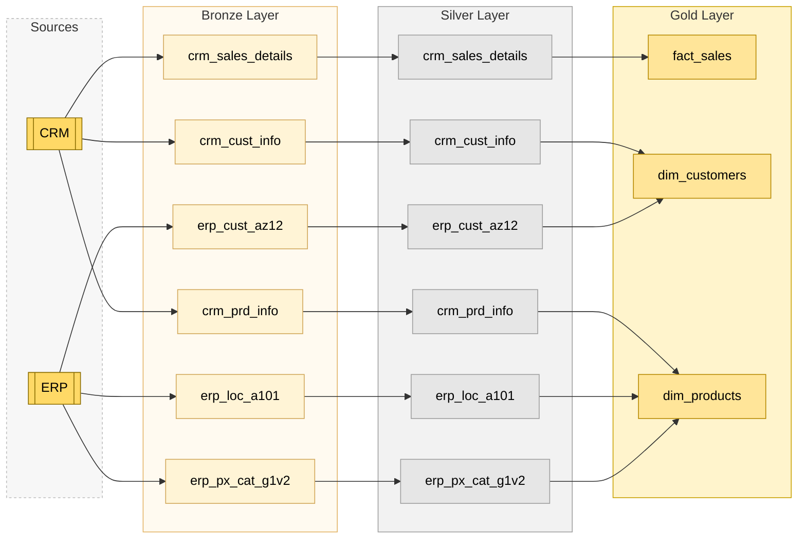

# Data Flow Chart

```mermaid
flowchart LR
  %% LAYOUT
  classDef src fill:#ffd966,stroke:#8a6d00,color:#000;
  classDef bronze fill:#fff4d6,stroke:#d1a75a,color:#000;
  classDef silver fill:#e6e6e6,stroke:#9e9e9e,color:#000;
  classDef gold fill:#ffe599,stroke:#b68900,color:#000;

  subgraph S["Sources"]
    CRM[[CRM]]
    ERP[[ERP]]
  end

  subgraph B["Bronze Layer"]
    b_sales[crm_sales_details]
    b_cust[crm_cust_info]
    b_prd[crm_prd_info]
    b_az12[erp_cust_az12]
    b_loc[erp_loc_a101]
    b_cat[erp_px_cat_g1v2]
  end

  subgraph SV["Silver Layer"]
    s_sales[crm_sales_details]
    s_cust[crm_cust_info]
    s_prd[crm_prd_info]
    s_az12[erp_cust_az12]
    s_loc[erp_loc_a101]
    s_cat[erp_px_cat_g1v2]
  end

  subgraph G["Gold Layer"]
    g_fact[fact_sales]
    g_dimc[dim_customers]
    g_dimp[dim_products]
  end

  %% Edges: Sources -> Bronze
  CRM --> b_sales
  CRM --> b_cust
  CRM --> b_prd
  ERP --> b_az12
  ERP --> b_loc
  ERP --> b_cat

  %% Bronze -> Silver
  b_sales --> s_sales
  b_cust  --> s_cust
  b_prd   --> s_prd
  b_az12  --> s_az12
  b_loc   --> s_loc
  b_cat   --> s_cat

  %% Silver -> Gold
  s_sales --> g_fact
  s_cust  --> g_dimc
  s_az12  --> g_dimc
  s_prd   --> g_dimp
  s_loc   --> g_dimp
  s_cat   --> g_dimp

  %% Styles
  class CRM,ERP src
  class b_sales,b_cust,b_prd,b_az12,b_loc,b_cat bronze
  class s_sales,s_cust,s_prd,s_az12,s_loc,s_cat silver
  class g_fact,g_dimc,g_dimp gold

  %% (Facoltativo) stile dei contenitori
  style S  fill:#f7f7f7,stroke:#bdbdbd,stroke-dasharray: 3 3
  style B  fill:#fffaf0,stroke:#e2b365
  style SV fill:#f2f2f2,stroke:#9e9e9e
  style G  fill:#fff4cc,stroke:#c8a100
```
