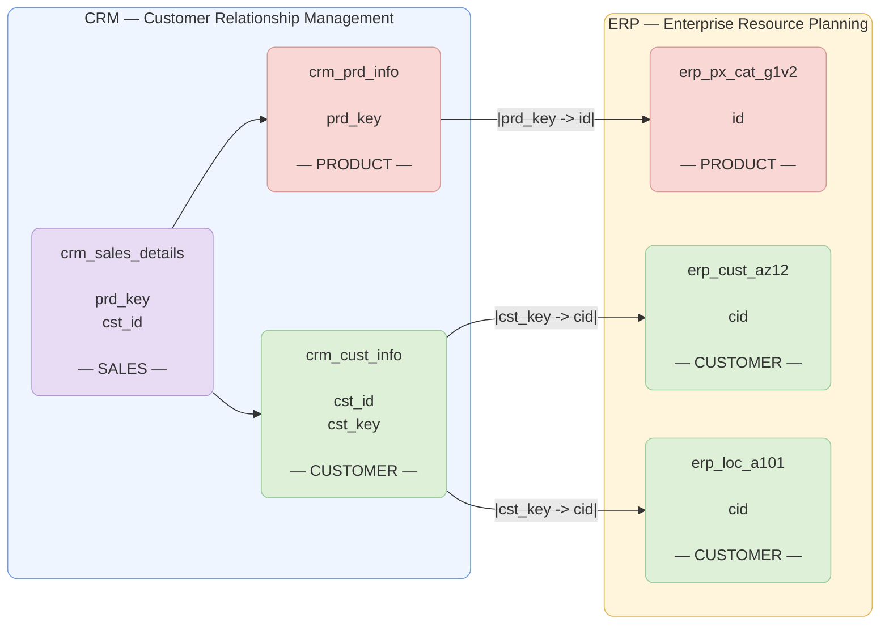

# Data Integration

```mermaid
flowchart LR
  subgraph CRM["CRM — Customer Relationship Management"]
    direction TB
    crm_sales["crm_sales_details\n\nprd_key\ncst_id\n\n— SALES —"]
    crm_prd["crm_prd_info\n\nprd_key\n\n— PRODUCT —"]
    crm_cust["crm_cust_info\n\ncst_id\ncst_key\n\n— CUSTOMER —"]
  end

  subgraph ERP["ERP — Enterprise Resource Planning"]
    direction TB
    erp_cat["erp_px_cat_g1v2\n\nid\n\n— PRODUCT —"]
    erp_az12["erp_cust_az12\n\ncid\n\n— CUSTOMER —"]
    erp_loc["erp_loc_a101\n\ncid\n\n— CUSTOMER —"]
  end

  %% Relationships inside CRM
  crm_sales --> crm_prd
  crm_sales --> crm_cust

  %% CRM ↔ ERP Integrations (GitHub-safe labels)
  crm_prd --|prd_key -> id|--> erp_cat
  crm_cust --|cst_key -> cid|--> erp_az12
  crm_cust --|cst_key -> cid|--> erp_loc

  %% Simple styling
  classDef sales    fill:#e8dcf5,stroke:#b099d0,rx:8,ry:8;
  classDef product  fill:#f9d7d5,stroke:#d69a96,rx:8,ry:8;
  classDef customer fill:#dff0d8,stroke:#9ccc9c,rx:8,ry:8;
  classDef groupCRM fill:#eef5ff,stroke:#6f9ae6,rx:10,ry:10;
  classDef groupERP fill:#fff5dc,stroke:#e0b75a,rx:10,ry:10;

  class crm_sales sales;
  class crm_prd product;
  class crm_cust customer;
  class erp_cat product;
  class erp_az12 customer;
  class erp_loc customer;
  class CRM groupCRM;
  class ERP groupERP;


```
