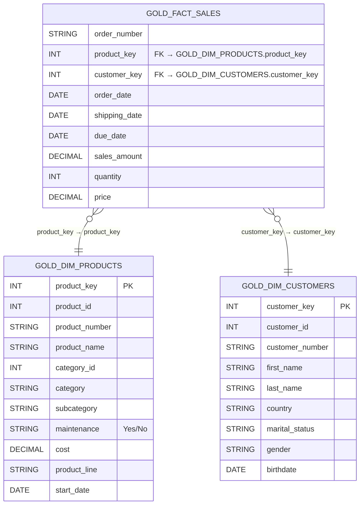

# Data Model

```mermaid

erDiagram
  GOLD_DIM_CUSTOMERS {
    INT    customer_key  "PK"
    INT    customer_id
    STRING customer_number
    STRING first_name
    STRING last_name
    STRING country
    STRING marital_status
    STRING gender
    DATE   birthdate
  }

  GOLD_DIM_PRODUCTS {
    INT    product_key   "PK"
    INT    product_id
    STRING product_number
    STRING product_name
    INT    category_id
    STRING category
    STRING subcategory
    STRING maintenance    "Yes/No"
    DECIMAL cost
    STRING product_line
    DATE   start_date
  }

  GOLD_FACT_SALES {
    STRING order_number
    INT    product_key    "FK → GOLD_DIM_PRODUCTS.product_key"
    INT    customer_key   "FK → GOLD_DIM_CUSTOMERS.customer_key"
    DATE   order_date
    DATE   shipping_date
    DATE   due_date
    DECIMAL sales_amount
    INT    quantity
    DECIMAL price
  }

  %% Relazioni (molti-a-uno dal FACT alle DIM)
  GOLD_FACT_SALES }o--|| GOLD_DIM_PRODUCTS : "product_key → product_key"
  GOLD_FACT_SALES }o--|| GOLD_DIM_CUSTOMERS : "customer_key → customer_key"


```
