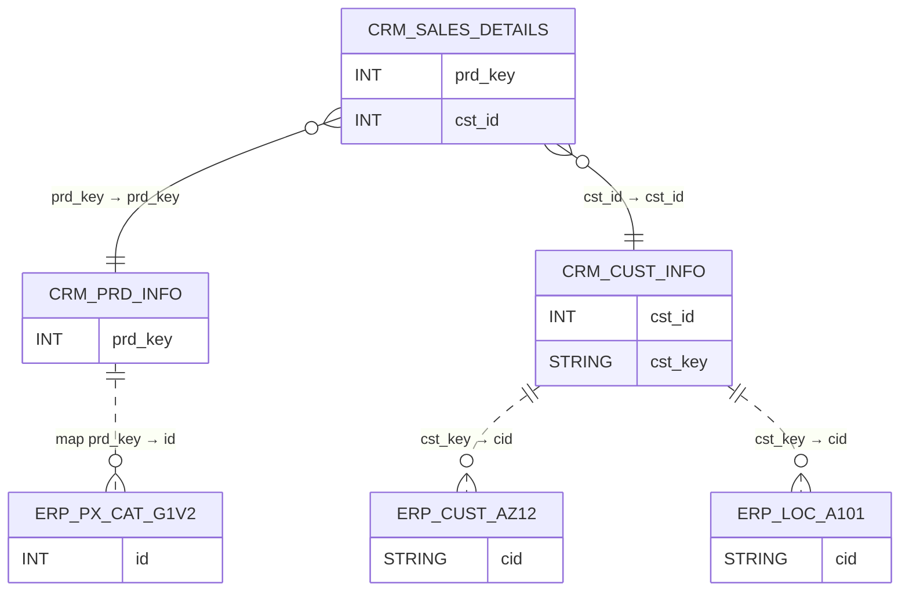

# ERD

```mermaid
erDiagram
  CRM_SALES_DETAILS {
    INT prd_key
    INT cst_id
  }

  CRM_PRD_INFO {
    INT prd_key
  }

  CRM_CUST_INFO {
    INT cst_id
    STRING cst_key
  }

  ERP_PX_CAT_G1V2 {
    INT id
  }

  ERP_CUST_AZ12 {
    STRING cid
  }

  ERP_LOC_A101 {
    STRING cid
  }

  %% Relazioni principali (come nel tuo disegno)
  CRM_SALES_DETAILS }o--|| CRM_PRD_INFO : "prd_key → prd_key"
  CRM_SALES_DETAILS }o--|| CRM_CUST_INFO : "cst_id → cst_id"

  %% Integrazione CRM ↔ ERP
  CRM_PRD_INFO ||..o{ ERP_PX_CAT_G1V2 : "map prd_key → id"
  CRM_CUST_INFO ||..o{ ERP_CUST_AZ12  : "cst_key → cid"
  CRM_CUST_INFO ||..o{ ERP_LOC_A101   : "cst_key → cid"
```
